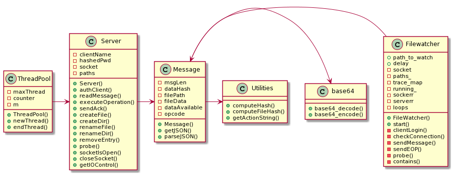
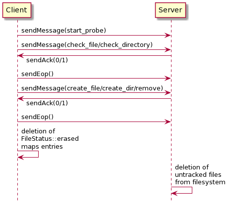
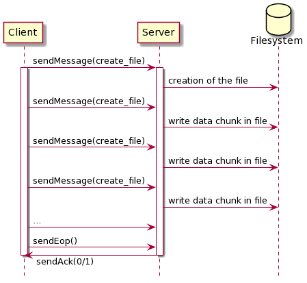

## Project m1: Remote backup
Authors: Mega Gianluca, Panduri Santa, Pappadà Matteo

## Contents

- [Abstract](#abstract)
- [High level design](#high-level-design)
- [Low level design](#low-level-design)
- [Sequence diagrams](#sequence-diagrams)

### Abstract
The remote backup project aims to create a client-server software for the remote backup of a specified folder constantly monitored by the client module. In case of connection faults the client will continue monitoring for changes and will propagate them to the server as soon as the connection gets back.
This software has been designed to be platform independent so it should run properly on both Windows and Unix systems.

### High level design
The product follows a client-server architecture with some support libraries shared between the two modules. The communication is made via boost stream-oriented sockets that ensure the cross-compatibility of the connection. A communication protocol has been set up based on the class Message: outgoing messages are sent as the JSON representation of a properly filled instance of `Message`; incoming messages are received as a sting of characters which dimension could be read as the first `MAX_MSG_LEN` bytes (defined in `Message`) of the received data (this is made in order to avoid reading the next message in the socket queue).

Data chunks are sent Base64 encoded thanks to the `base64 encoding and decoding with C++` library from René Nyffenegger (rene.nyffenegger@adp-gmbh.ch), more details about this library can be found at https://renenyffenegger.ch/notes/development/Base64/Encoding-and-decoding-base-64-with-cpp/. Thanks a lot for your work!

When sending a file a SHA3-256 digest is computed and sent with the messages; digest computation is made thanks to the OpenSSL library (https://www.openssl.org/).

After having received a message both client and server take some proper action based on the received `opcode` and replies to the counterpart with an `ok` or `error` message.

In order to keep client and server in sync a probe function is provided. This operation is started with the `start_probe` message that enables the server to start receiving probe messages. Three phases are involved:
1. `check_file` or `check_dir` messages to check if the entries are stored on the server 
2. re-sending the operation on the entry only for invalid files/directories
3. - client-side: deleting erased entries from paths maps
    - server-side: deleting (from disk) untracked entries

The server is implemented in a multithread way thanks to the ThreadPool class. It keeps track of the number of the created threads and disables the creation of them if a maximum amount is reached. For every new connection a new thread is detached.

If server doesn't receive any message for a defined period of time the thread is ended.

The client is able to automatically resume the connection with the server if some error on the socket is encountered without any action from the user. The client continues to keep track of the modifications on the monitored directory even if there are errors or connection problems: it will sync the entries as soon as the connection is resumed.

In the `credentials.md` file are listed the access credentials of every user while the real authentication is done by the server using the `auth.txt` file.

In `Common/parameters.h` are listed some functional parameters like the adress of the server, the location of the client's configuration file and some time parameters for the modifications scan done by the software.

In `Client/client.conf` all the access data of the client are stored along with the path of the observed directory. In case of errors the software will ask the user to input the correct data and it will automatically modify this file in a complete traansparent way to the user.
### Low level design

 *unused functions and getters/setters are omitted for simplicity 

### Sequence diagrams
#### Probe function

#### Creation of a file
